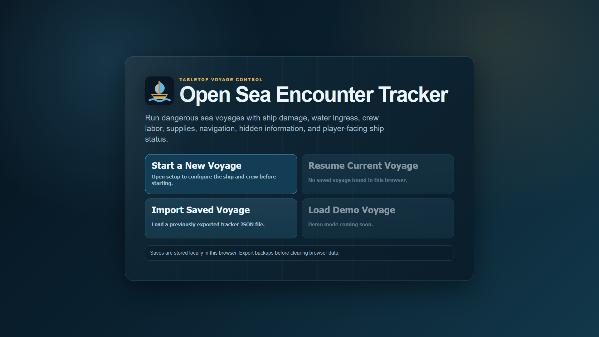
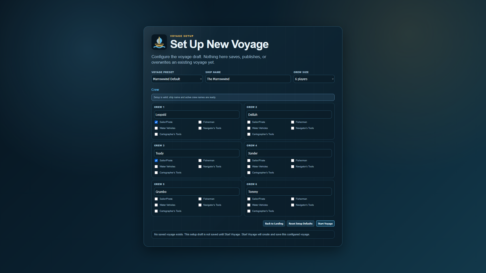
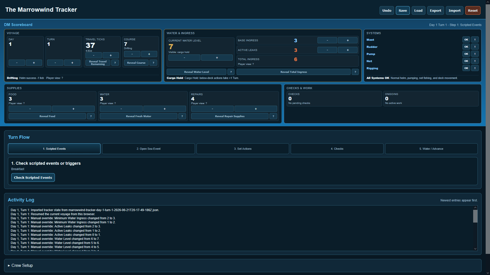
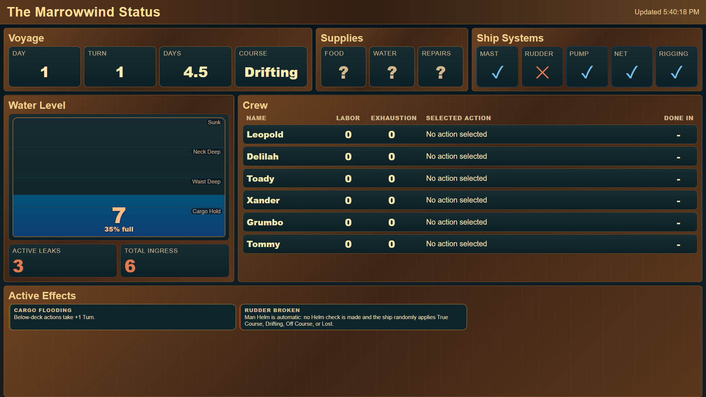

# Marrowwind Open Sea Tracker

A browser-based tracker for running dangerous open sea voyage rules.

The DM screen manages startup, setup, turn flow, actions, checks, water, supplies, ship systems, hidden state, saving, importing, and scripted events. The player screen shows only player-facing information and updates automatically from the DM screen.

This project is currently built around the Marrowwind voyage, but the long-term goal is to move toward a more reusable open sea encounter tracker.

---

# Current Status

This project is a working MVP.

Current features include:

- DM-facing tracker screen
- Player-facing display screen
- Startup landing screen
- New voyage setup screen
- Configurable ship name
- Configurable crew size
- Configurable crew names
- Configurable crew background/proficiency traits
- Setup validation
- Save-overwrite protection
- Resume current browser save
- Import exported voyage saves
- Turn-flow guidance
- Open Sea Event handling
- Scripted scene turns
- Crew action assignment
- Required checks and saves
- Water ingress tracking
- Course Meter and travel tracking
- Player knowledge and hidden information
- Save, load, export, import, reset, and undo
- Input validation and import hardening
- Automated test suite
- GitHub Actions CI
- Manual browser testing checklist

---

# Quick Start

## DM Screen

Open:

```text
open_sea_tracker.html
```

The DM screen opens to a startup landing screen.

Choose one of the startup actions:

- **Start a New Voyage**: opens the setup screen.
- **Resume Current Voyage**: resumes the saved voyage stored in this browser.
- **Import Saved Voyage**: imports a previously exported tracker `.json` file.

If no saved voyage exists in the current browser profile, **Resume Current Voyage** should be unavailable.

To start a new voyage:

1. Click **Start a New Voyage**.
2. Configure the voyage preset, ship name, crew size, crew names, and crew traits.
3. Fix any setup validation errors.
4. Click **Start Voyage**.
5. If an existing save is present, confirm that you want to replace it.

**Start Voyage** creates the tracker state, saves it to browser storage, publishes the player-safe state, and enters the tracker screen.

## Player Screen

Open:

```text
player_view.html
```

Use this on a second monitor, projector, or player-facing browser window.

Keep both pages in the same browser profile so they share `localStorage`. The player screen updates automatically as the DM tracker changes.

No server or build step is required. The app can be opened directly in a browser or through a local development server such as VS Code Live Server.

---

# Screenshots

## Landing Screen



## New Voyage Setup



## DM Tracker



## Player View



---

# Recommended Screen Setup

- Put `open_sea_tracker.html` on the DM/private monitor.
- Put `player_view.html` fullscreen on the player-facing monitor.
- Open both pages in the same browser profile.
- If the player screen does not update, refresh `player_view.html` once after opening the DM tracker.

---

# Project Structure

## Main Pages

- `open_sea_tracker.html` - DM-facing tracker.
- `player_view.html` - player-facing display for a second monitor.

## JavaScript

- `js/action_metadata.js` - shared action definitions and action metadata.
- `js/tracker_state.js` - shared DM tracker state, rule tables, scripted events, setup defaults, validation constants, and low-level rule helpers.
- `js/tracker_render_setup.js` - landing screen and setup screen rendering.
- `js/tracker_render.js` - main DM render dispatcher and tracker-screen rendering.
- `js/tracker_gameplay.js` - DM actions, prompts, turn flow, event handlers, meals, and overtime handlers.
- `js/tracker_persistence.js` - save/load, player-state publishing, validation, migration, import/export, and labels.
- `js/tracker_setup.js` - setup-mode behavior and setup-to-state creation.
- `js/tracker.js` - small DM tracker bootstrap loaded after the support scripts.
- `js/player_view.js` - player screen rendering and sync logic.

## Styling and Assets

- `css/styles.css` - shared styling for both screens.
- `assets/favicon.svg` - app favicon.

## Tests and Tooling

- `tests/` - Node test suite for tracker rules, import validation, event binding coverage, setup flow, save-overwrite protection, player view behavior, and startup behavior.
- `package.json` - npm scripts for formatting, syntax checks, CI, and tests.
- `.github/workflows/ci.yml` - GitHub Actions workflow.
- `.prettierrc` - Prettier formatting configuration.
- `.prettierignore` - files ignored by Prettier.
- `.vscode/settings.json` - workspace settings, including Live Server file-watch ignores.

## Documentation

- `docs/MANUAL_TESTING.md` - browser smoke-test checklist.
- `docs/ROADMAP.md` - development roadmap.
- `docs/design_document.txt` - system design notes and turn structure.
- `docs/MarrowWindActions.txt` - current action reference.
- `docs/CHANGELOG.md` - practical current-state history notes.

---

# Development Commands

Run all standard checks:

```sh
npm run ci
```

This runs:

```sh
npm run format:check
npm run check:syntax
npm test
```

Run only the automated tests:

```sh
npm test
```

Run Prettier formatting:

```sh
npm run format
```

Check formatting without changing files:

```sh
npm run format:check
```

Run syntax checks:

```sh
npm run check:syntax
```

---

# Testing

The formal test suite loads the browser scripts in a Node VM and checks:

- Browser validation suite behavior
- State restoration after validation
- Import validation
- Import migration
- Unsafe import rejection
- Out-of-range import rejection
- Malformed nested import rejection
- Ship-name migration and validation
- Pending prompt escaping
- Delegated event-handler coverage
- Startup landing screen behavior
- Setup screen behavior
- Setup validation
- Setup-created tracker state
- Save-overwrite protection
- Old save migration
- New voyage creation
- Setup-created player state
- Player travel rounding
- Navigate reveal behavior
- Water visibility behavior
- Player effect rendering
- Scripted scene behavior

The browser behavior checklist is in:

```text
docs/MANUAL_TESTING.md
```

Run the manual checklist after changes that affect rendering, buttons, turn flow, player view publishing, import/export, localStorage, startup behavior, setup behavior, or major layout.

---

# Startup Landing Screen

The DM page opens to a landing screen before entering the tracker.

Startup actions:

## Start a New Voyage

Opens the setup screen.

Opening setup does not overwrite an existing save. Setup changes stay temporary until **Start Voyage** is clicked.

If a saved voyage already exists, the app asks for confirmation before **Start Voyage** replaces it.

## Resume Current Voyage

Loads the existing browser save from `localStorage`.

This should not overwrite the saved voyage. It only reads and resumes the current save.

## Import Saved Voyage

Opens the import flow for a previously exported tracker `.json` file.

The import uses validation and migration before replacing the current state.

## Demo Mode

Demo mode is planned but not part of the current core flow unless implemented in the app.

---

# New Voyage Setup

**Start a New Voyage** opens a setup screen before the tracker state is created.

Setup fields:

- Voyage preset
- Ship name
- Crew size
- Crew names
- Sailor/Pirate
- Fisherman
- Water Vehicles
- Navigator's Tools
- Cartographer's Tools

Setup validation:

- Ship name is required.
- Ship name must stay within the configured maximum length.
- Active crew names are required.
- Active crew names must stay within the configured maximum length.
- Active crew names must be unique after trimming.
- Duplicate crew-name detection is case-insensitive.
- Inactive crew rows do not block setup validation.

Setup behavior:

- Editing setup fields does not save or publish anything.
- **Back to Landing** does not overwrite the current save.
- **Reset Setup Defaults** resets only the temporary setup draft.
- **Start Voyage** validates the setup.
- Invalid setup stays on the setup screen and shows errors.
- Valid setup creates the tracker state, saves it, publishes player state, and enters tracker mode.
- If an existing save is present, the app asks before replacing it.
- Cancelling the overwrite confirmation preserves the existing saved voyage and the existing published player state.

Crew traits affect existing advantage prompt text:

- Sailor/Pirate and Water Vehicles apply to Helm guidance.
- Navigator's Tools and Cartographer's Tools apply to Navigate / Study Map guidance.
- Fisherman applies to fishing guidance.

---

# DM Turn Flow

Use the `Turn Flow` panel on the DM screen. It walks through the current turn in order:

1. Check scripted/start-turn events.
2. Roll or manually enter the Open Sea Event d20 result.
3. Confirm the Open Sea Event.
4. Set each character's action.
5. Resolve required checks and saves.
6. Apply the water update.
7. Advance the turn.

The visible DM panels change based on the current step so the screen only shows what is needed for that part of the turn.

---

# Setting Crew Actions

Use each character's action dropdown in the `Crew` panel.

Important behavior:

- Confirm characters individually when ready.
- Confirming a character records intent.
- Labor changes, action starts, and required prompts are created when the tracker advances from `Set Actions` to `Checks`.
- Actions that require two players cannot be confirmed until the required participants are selected.
- Ongoing multi-turn work is automatically selected on following turns.
- Use `Clear` on a character row to clear that character's planned action.
- Use `Set Unset to Idle` to quickly fill empty actions before advancing.

---

# Checks, Saves, and Prompts

The `Required Checks` area displays prompts created by events, actions, labor thresholds, meals, rest, and water effects.

Important behavior:

- Resolve prompts before advancing past their turn-flow step.
- Some prompts reveal information to the player screen.
- Manual prompts exist when the DM needs to apply a rule result outside the tracker.
- Prompt text is escaped so imported text is displayed safely.

---

# Scoreboard

The DM scoreboard stays visible while running turns.

It shows key reference values such as:

- Day and turn
- Water level
- Food and fresh water
- Repair supplies
- Minimum ingress and total ingress
- Active leaks
- Travel remaining
- Ship systems
- Active water effects
- Pending checks

Most scoreboard values have manual `+` and `-` controls so the DM can override state when needed.

---

# Water and Flooding

Water level is tracked on both screens.

Player-facing water behavior:

- The player screen shows a large water meter.
- If water is below the cargo hold and the players have not checked the bilge sounding rod, the player screen indicates that the bilge is not yet flooding without revealing the exact level.
- Once water reaches the cargo hold, the player screen automatically shows the current level.
- Flooding effects are shown on both screens when active.
- Total ingress is revealed to players only when a rule reveals it, such as Bilge Sounding Rod success or repeated water-level knowledge.

DM-facing water behavior:

- Minimum ingress represents unavoidable water gain.
- Active leaks increase total ingress.
- Pumping and bucket actions can reduce water.
- Water formula application is a specific turn-flow step.
- The app prevents accidental repeated water updates during the same turn unless intentionally reset.

---

# Course Meter and Travel

Travel is stored internally as ticks:

```text
8 ticks = 1 day
```

The DM scoreboard shows exact travel ticks, Course Meter, and Course State.

The player screen shows revealed travel as a readable value rounded to the nearest half day.

`Navigate / Study Map` adjusts the Course Meter and reveals:

- Course State
- Travel Remaining rounded to the nearest half day

This reveal happens whether the check succeeds or fails.

If Navigate / Study Map resolves during a turn, the normal end-of-turn Course Meter decay is skipped for that turn.

`Man Helm` applies travel progress based on the current Course State:

- Critical success applies one better Course State and improves Course Meter.
- Success applies the current Course State.
- Failure applies one worse Course State.
- Critical failure applies one worse Course State and reduces Course Meter.

Broken mast and broken rudder states change Helm behavior and prevent the normal Helm check.

---

# Player Knowledge

Some player-facing values start unknown and display as hidden until learned in play.

Players can learn values through actions such as:

- `Navigate / Study Map` - reveals Course State and rounded Travel Remaining.
- `Inventory Food` - reveals food.
- `Inventory Water` - reveals fresh water.
- `Inventory Repair Supplies` - reveals repair supplies.
- `Examine Bilge Sounding Rod` - reveals water level. Success reveals total ingress immediately.

The DM can also manually reveal or hide values from the scoreboard controls.

The player screen should not show DM-only information such as Minimum Ingress.

---

# Player Screen

The player screen displays:

- Ship name
- Voyage day and turn
- Travel remaining, if known
- Water level meter
- Active leaks
- Total ingress, if known
- Supplies, if known
- Ship systems
- Crew labor, exhaustion, and current or most recent action
- Active effects
- Ongoing work

The player screen receives a filtered player-safe state from the DM tracker through browser `localStorage`.

---

# Scripted Scene Turns

Use `Force All Idle for Scene` when a scripted encounter turn should be narrated and handled manually instead of resolving normal ship actions.

This action:

- Sets crew actions to Idle
- Removes normal action checks for the turn
- Pauses ongoing work
- Leaves scoreboard overrides available
- Records the scene handling in the activity log

Scripted events can also apply mechanical changes, such as increasing Minimum Water Ingress during Sehanine's Storm.

---

# Night Overtime

At nighttime, the tracker checks dinner first. The DM can then either stop to rest or start Night Overtime.

Important behavior:

- Use `Start Night Overtime` if the crew keeps working after the scheduled rest point.
- Normal turns continue while Night Overtime is active.
- Water still updates.
- Actions still work.
- Open Sea Events can still be rolled.
- At the end of each overtime turn, characters with confirmed non-idle actions receive Constitution save prompts.
- Failed overtime saves add visible Exhaustion and tracked overtime Exhaustion.
- Use `End Night Overtime and Rest` when the crew finally stops.

Breakfast resolves overnight recovery:

- Dinner + breakfast recovers 3 Labor and clears overtime Exhaustion.
- Dinner only recovers 1 Labor and clears overtime Exhaustion.
- Breakfast only recovers 2 Labor and clears 1 overtime Exhaustion.
- Neither recovers 1 Labor and prompts Constitution saves starting at DC 15, +2 per consecutive day without meals, with no cap.

Standard day/night timing happens after Turn 8.

---

# Saving, Loading, and Refreshing

The tracker uses browser `localStorage`.

Important behavior:

- Setup draft changes are temporary and are not saved automatically.
- **Start Voyage** is the point where a setup-created voyage is saved and published.
- If an existing save is present, **Start Voyage** asks before replacing it.
- **Back to Landing** and **Reset Setup Defaults** do not replace the current save.
- Use **Resume Current Voyage** on the landing screen to resume the saved browser state.
- Use **Save** on the DM screen to manually save the full tracker state.
- Use **Export** to download the current tracker state as a `.json` backup file.
- Use **Import** or **Import Saved Voyage** to restore a previously exported `.json` backup file.
- Use **Undo** to restore the state from before the last meaningful change.
- The app keeps the 20 most recent undo snapshots for the current page session.
- Use **Reset** only when you want to start over.

Important:

Saved data is tied to the browser profile and local page/site data. If you switch browsers, clear site data, use a private window, or change how the page is hosted, saved state may not be available.

Exported files go to the browser's normal download location, usually the Downloads folder unless your browser asks where to save each file.

Import accepts JSON tracker-state objects up to 1 MB, validates the payload, migrates compatible older saves, rejects unsafe object keys, and validates the migrated state before replacing the current tracker state.

`Undo` can restore the state from before the import during the same page session.

---

# Activity Log

The activity log appears at the bottom of the DM page.

It records human-readable events such as:

- Startup/resume/import activity
- New voyage creation
- Confirmed actions
- Labor changes
- Repairs completed
- Supplies spent
- Open Sea Events resolved
- Scripted scene handling
- Turn advancement

Use it to audit what happened if you need to check whether something was already applied.

---

# Manual Browser Testing

Use:

```text
docs/MANUAL_TESTING.md
```

The manual checklist covers browser behavior that the automated tests do not fully prove, including:

- DM screen loading
- Player screen loading
- Startup landing screen behavior
- New voyage setup behavior
- Setup validation
- Save-overwrite protection
- Turn flow
- Action assignment
- Navigate reveal behavior
- Helm behavior
- Water visibility
- Import/export
- Invalid import rejection
- Prompt escaping
- Player view sync
- Layout smoke testing

---

# Troubleshooting

## Player screen is blank

Open `open_sea_tracker.html` first, then refresh `player_view.html`.

## Player screen is not updating

Make sure both pages are open in the same browser profile.

Refresh the player screen once if needed.

## Resume Current Voyage is disabled

No saved voyage was found in the current browser profile.

Start a new voyage or import an exported save.

## Start Voyage is disabled

The setup form has validation errors.

Check the setup error message, then confirm that the ship name is valid and all active crew names are valid and unique.

## My existing save was not replaced after backing out of setup

That is intended.

Opening setup, editing setup fields, using **Reset Setup Defaults**, and clicking **Back to Landing** do not overwrite saved data. The existing save is only replaced by a valid **Start Voyage** submit after overwrite confirmation.

## Saved state is missing

The browser may have cleared local site data, or the page may be running under a different browser/profile/origin than before.

Use exported `.json` backups to protect important saves.

## Layout looks wrong

Use a modern desktop browser and fullscreen the player view on a 16:9 display.

## A rule result needs correction

Use the DM scoreboard override controls and the activity log to document the correction.

## Import fails

Check that the file is a valid exported tracker `.json` file and is under the import size limit.
